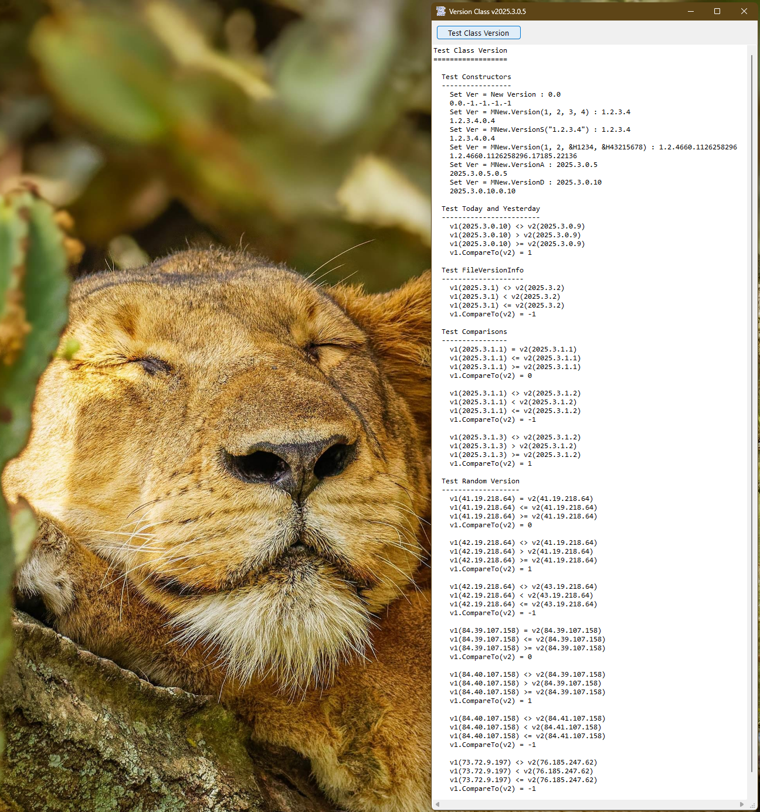

# Sys_Version  
## Easy Comparison  

[](https://github.com/OlimilO1402/Sys_Version/blob/master/LICENSE) 
[](https://github.com/OlimilO1402/Sys_Version/releases/latest)
[](https://github.com/OlimilO1402/Sys_Version/releases/download/v2025.3.2/Version_v2025.3.2.zip)


Easy Comparison  
===============  
  
For comparing e.g. two numbers in any serious programming language, there are the typical operator characters of course everybody knows.  
like the following:  
  
 |  VB   |  C#   |  meaning   
 |:-----:|:-----:|:----------------  
 |  =    |  ==   |  Equality  
 |  \<>  |  !=   |  Not Equal  
 |  \<=  |  \<=  |  Less then or equal  
 |  \>=  |  \>=  |  Greater then or equal  
 |  \<   |  \<   |  Less then  
 |  \>   |  \>   |  Greater then  
 |       |       |  int CompareTo(other)  

For comparing two objects (of a class), in other languages, there is something called operator overloading.  
What just means you can write a function that has an operator-character as the "function name".  
In VBA/VBC we do not have operator overloading, but we do not bother, we even do not need this.  
It is just "syntactic sugar" to make code more readable, and imho it does not fulfill it's purpose in every
situation.  
In fact writing named member-functions is readable enough for comparing two objects.  
  
So have a look at the list above. Do we need a function for every operator, for every possible comparison?  
Yes, we maybe actually need all the above functions, but did you know that we actually need only 2 functions,
and all the other operations are just a combination of that two functions?  
  
In VBA/VBC we dim a Boolean and per se the boolean has the value "False". VB does this for us, so there is no
need for an extra initialization of a Boolean variable or also even a Boolean function.  
  
The 2 functions we need are:
* a public member function "Equals" where we just hand over the "other" object and  
* a private function "IsGreaterOrEqual" where we give two objects;  
  this function could also be static/shared in a standard module ...  
  
...and all the other operator-functions are just combinations of this two functions.  
  
To give this something what actually makes sense we could imagine a class "Version" with the  
member properties Major, Minor, Build And Revision ([compare: Version class](https://learn.microsoft.com/en-us/dotnet/api/system.version?view=net-8.0))  
Maybe we have a situation where we have different versions of a file or a program, and in our program
we want to react on it.  
Here are the 2 main full-size functions we need:  

```vba  
Public Function Equals(Other As Version) As Boolean  
    If Me.Major <> Other.Major Then Exit Function  
    If Me.Minor <> Other.Minor Then Exit Function  
    If Me.Build <> Other.Build Then Exit Function  
    If Me.Revision <> Other.Revision Then Exit Function  
    Equals = True  
End Function  
  
Private Function IsGreaterOrEqual(Version As Version, Other As Version) As Boolean  
    If Version.Major < Other.Major Then Exit Function  
    If Version.Minor < Other.Minor Then Exit Function  
    If Version.Build < Other.Build Then Exit Function  
    If Version.Revision < Other.Revision Then Exit Function  
    IsGreaterOrEqual = True  
End Function  
```
  
And this are the very slim functions for all other comparisons:  
  
```vba  
Public Function IsLessThen(Other As Version) As Boolean  
    IsLessThen = IsGreater(Other, Me)  
End Function  
  
Public Function IsLessThenOrEqual(Other As Version) As Boolean  
    IsLessThenOrEqual = IsGreaterOrEqual(Other, Me)  
End Function  
  
Public Function IsGreaterThen(Other As Version) As Boolean  
    IsGreaterThen = IsGreater(Me, Other)  
End Function  
  
Public Function IsGreaterThenOrEqual(Other As Version) As Boolean  
    IsGreaterThenOrEqual = IsGreaterOrEqual(Me, Other)  
End Function  
  
Private Function IsGreater(Version As Version, Other As Version) As Boolean  
    If Not IsGreaterOrEqual(Version, Other) Then Exit Function  
    IsGreater = Not Version.Equals(Other)  
End Function  
  
Public Function CompareTo(Other As Version) As Long  
    If Me.Equals(Other) Then Exit Function  
    If Me.IsLessThen(Other) Then CompareTo = -1: Exit Function 
    If Me.IsGreaterThen(Other) Then CompareTo = 1: Exit Function  
End Function  
```  
  
Pay attention on what comparing operator characters we actually needed:  
just "<> Not Equal" and "< Less then", no need for the other operator-characters.  
  
  
  